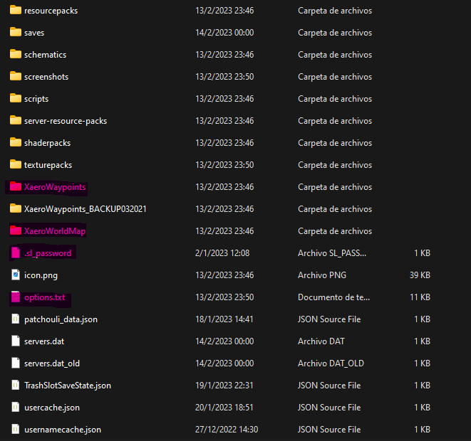

# Actualización

Para actualizar el modpack es tan sencillo como descargar la última versión del [servidor de archivos](https://files.notienenombre.net.ar/cockland), y arrastrarla al launcher como hicimos al instalarlo por primera vez.

:::caution Atención
La nueva versión no va a respetar nuestra configuración anterior y no se va a acordar de nuestros waypoints ni de nuestra contraseña. Para solucionar esto lea la siguiente sección.
:::

## Transferir datos y configuraciones antiguas

Los archivos que nos interesan transferir a la nueva versión son aquellos que contienen nuestra configuración, waypoints (marcadores del mapa) y nuestra contraseña. Para hacer esto estan sencillo como seguir los siguientes pasos:

1. Dentro de launcher, hacer click derecho sobre la versión anterior y en el botón de "Carpeta".
2. Entrar a la carpeta de "minecraft" en el explorador que se abrió.
3. Dentro de esta carpeta buscar las siguientes carpetas o archivos:

   - `XaeroWaypoints`
   - `XaeroWorldMap`
   - `options.txt`
   - `.sl_password`

   

4. Copiar los archivos a un lugar de nuestra preferencia o simplemente al portapapeles.
5. Repetir el primer paso pero para la nueva versión.
6. Pegar los archivos previamente copiados a la carpeta que se acaba de abrir, sobreescribiendo los archivos que sean necesarios.
