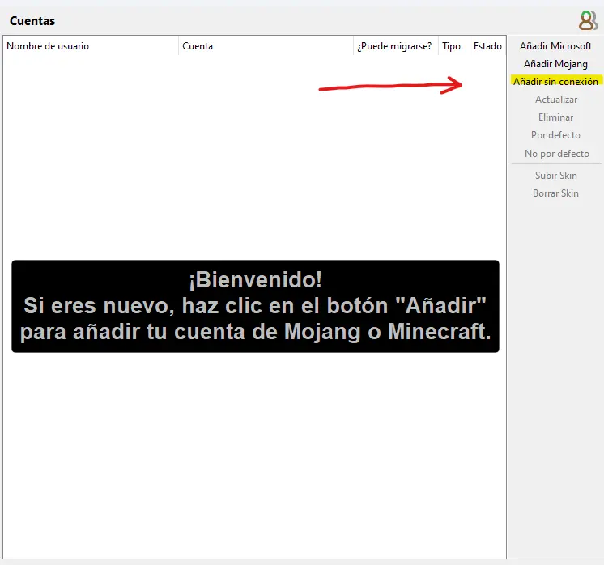

# Instalación

Bienvenidos a la segunda temporada de NTN Land, a continuación se encuentran las instrucciones de instalación.

## Requerimientos

Para poder correr el modpack con un rendimiento decente es necesario al menos:

- Procesador de 4 núcleos
- 16 GB de RAM (con 8 GB puede funcionar pero no es recomendable)
- GPU relativamente reciente, o una RTX 2060 o equivalente para arriba para usar shaders

Para instalar el modpack, tanto como para correr Minecraft es necesario tener Java 17 instalado.

## Instalación de Java

Si ya tenes Java instalado, podes seguir con la siguiente sección.

Descargar e instalar Java desde el siguiente link: <https://adoptium.net/es/download/>

:::caution Importante
Asegurarse de marcar la casilla de establecer **JAVA_HOME** y agregar al **PATH**.
:::

## Descarga del modpack

Las descargas del modpack se pueden encontrar todas en una única y simple ubiación, el servidor oficial de archivos de No Tiene Nombre: <https://files.notienenombre.net.ar>, dentro de la carpeta [`ntn_land`](https://files.notienenombre.net.ar/ntn_land).

Los archivos del modpack tienen el nombre de `NTN_Land_vX.Y_(1.19.2).zip`, reemplazando la _X_ por el número de versión obligatoria e _Y_ por el número de versión opcional. El mayor número es el que deberíamos descargar.

Actualmente, la última versión es [`NTN_Land_v1.0_(1.19.2).zip`](https://files.notienenombre.net.ar/ntn_land/NTN_Land_v1.0_%281.19.2%29.zip).

## Launchers

Para jugadores con cuentas premium y para aquellos no premium hay dos launchers distintos, que si bien son iguales en cuanto a la apariencia y funcionalidad, tienen una diferencia muy imporante.

:::danger CUIDADO
**Jugadores premium:** Es MUY importante que no usen el launcher no premium, pero sobre todo NO introducir su cuenta premium dentro del launcher no premium si es que lo usan por alguna razón. Si bien el launcher no premium debería ser seguro y es libre de virus, es norma general no introducir cuentas legítimas en software "crackeado".
:::

### Launcher premium

El launcher por excelencia y el que más facilita las actualizaciones es [PrismLauncher](https://prismlauncher.org/download/).

Lo primero que vamos a hacer es descargar su versión instalable o portable (a preferencia del jugador) e instalarlo o extraerlo en un lugar cómodo y accesible.

Una vez hayamos abierto el programa y completado la configuración inicial, solo basta con arrastrar el .zip del modpack descargado anteriormente al launcher.

Por último, iniciaremos sesión con nuestra cuenta de Microsoft haciendo click en el botón de arriba a la derecha con la cara de Steve, y luego en "Gestionar cuentas", para poder agregar nuestra cuenta de Microsoft con el botón de "Añadir Microsoft" sobre la derecha.

### Launcher no premium

El launcher no premium es una copia exacta del launcher premium pero recompilado sin los chequeos de cuentas premium.

Para descargarlo simplemente hacemos click [aca](https://files.notienenombre.net.ar/PrismLauncher-NoPremium.zip).

:::caution Advertencia
Para evitar cualquier problema, limitarse a usar este launcher solo para entrar a NTN Land.
:::

Para instalar el pack de mods una vez hayamos abierto el programa y completado la configuración inicial, solo basta con arrastrar el .zip del modpack descargado anteriormente al launcher.

Para poder entrar al juego, hacemos click sobre el botón con la cara de Steve arriba a la derecha.

Luego en el botón de "Gestionar cuentas", y por último en el botón de "Añadir sin conexión". Escribimos nuestro nombre y listo.

## Entrar al servidor

Para entrar al servidor solo es necesario apretar el botón que dice "Entrar a NTN Land".

:::info
Antes de entrar al servidor ir a la pantalla de multijugador para introducir la contraseña que se usará para iniciar sesión en el servidor.
:::

## Cambiar cantidad de memoria RAM asignada

Para cambiar la cantidad de memoria RAM asignada debemos hacer los siguientes pasos:

1. Click derecho en el modpack y en el botón "Editar..."
2. Ir a la pestaña de configuración.
3. Marcar la casilla de "Memoria"
4. Asignar en ambos valores 8192 MB (recomendado) o 5144 MB.
